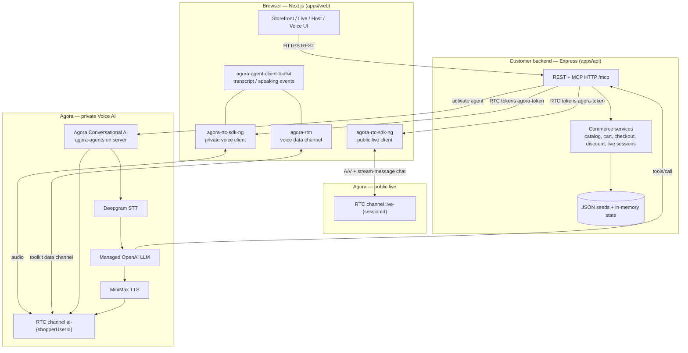

# Live Shop — AI-Powered Live Commerce Prototype

A working web prototype for the Agora Solutions Architect take-home: a conventional multi-category storefront, real-time live shopping, and a private voice AI shopping assistant. Agora handles realtime media and Conversational AI; the Node/Express backend remains authoritative for commerce, session policy, and discounts.

**Live demo:** [https://live-shop-teal.vercel.app](https://live-shop-teal.vercel.app)  
**API:** [https://live-shop-api-e8xv.onrender.com/health](https://live-shop-api-e8xv.onrender.com/health)

---

## Key capabilities

| Area | What works in this prototype |
| --- | --- |
| **Storefront** | Multi-category catalogue (electronics, apparel, cosmetics, etc.), search/filter, product detail pages, cart, mock checkout |
| **Live shopping** | Scheduled, LIVE, and ENDED sessions; host console; viewers watch host A/V on a public RTC channel |
| **Public live chat** | Host and viewers chat over **Agora RTC data streams** on the same live channel (not RTM, not HTTP relay in the UI) |
| **Private Voice AI** | Shopper opens **Ask AI** on storefront, live, or recorded session pages; private audio session runs in parallel with live/replay media (live audio is ducked) |
| **Commerce via voice** | Managed LLM calls MCP tools for search, product details, comparison, PIN serviceability, pricing, payment options, cart, checkout |
| **Live discount** | **20%** applied server-side only while the relevant live session is **LIVE** and the product belongs to that session; removed after END |
| **Recorded playback** | ENDED sessions show a deterministic bundled demo replay video (not the host’s actual stream) |

Cart and live-session mutations are **in-memory** on the API process. Restarting the API resets carts and live status to seed data.

---

## Architecture



**Media vs business:** Agora moves audio/video and runs the voice agent pipeline. The customer backend owns product data, carts, live-session status (`SCHEDULED` / `LIVE` / `ENDED`), discount rules, and MCP tool execution.

---

## Agora vs customer responsibility

| Agora (this prototype) | Customer / business (this prototype) |
| --- | --- |
| Public RTC channel `live-{sessionId}` — host A/V, viewer subscribe, RTC data-stream chat | Live session lifecycle, featured product, session product list |
| Private RTC channel `ai-{shopperUserId}` — shopper mic + agent TTS audio | Shopper identity (`shopper-ai-{tabId}`), cart keyed by `X-Shopper-Id` |
| RTC/RTM token minting via `agora-token` (local, not Agora REST) | Host claim (one `host-*` broadcaster per session, in-memory) |
| Conversational AI agent (`agora-agents`): Deepgram STT, managed OpenAI LLM, MiniMax TTS | System prompt, tool allowlist, validation, commerce logic |
| LLM invokes MCP over HTTPS → customer `/mcp` | `catalogService`, `cartService`, `discountService`, `checkoutService`, PIN/payment mocks |
| Browser toolkit events (transcript, speaking/thinking) via `agora-agent-client-toolkit` + `agora-rtm` | Voice session store, tool-session context (`lastProductId`, etc.) |
| **Not implemented:** Agora Cloud Recording, public RTM/Signaling chat | **Not implemented:** real auth, persistent DB, real payments |

---

## Live shopping flow

1. **Host** opens `/host`, clicks **Go live** → `POST /api/agora/rtc-token` (`role: host`, `userId` must start with `host-`).
2. Backend issues a token for channel **`live-{sessionId}`** and records a host claim.
3. Host browser joins with **`agora-rtc-sdk-ng`**, publishes camera + microphone, attaches chat (`attachRtcChat`).
4. After successful publish, host client calls **`POST /api/live-sessions/:id/start`** → application status **`LIVE`** (Agora does not set this).
5. **Viewer** opens `/live/{sessionId}`; when status is LIVE, requests audience token → joins the **same** `live-{sessionId}` channel → **subscribes** to host A/V (does not publish camera/mic in the UI).
6. **Public chat:** both sides use **`client.sendStreamMessage`** / **`stream-message`** on the live RTC client. No message goes through the REST chat endpoints used elsewhere in the API.
7. **End:** host ends broadcast → RTC cleanup → **`POST /api/live-sessions/:id/end`** → **`ENDED`**. Viewers disconnect and may see recorded replay.

**Important:** Application **LIVE** state is host-driven business logic. Agora only knows who is in the RTC channel.

**POC note:** Host and audience RTC tokens are both minted as **publisher-capable** (required for data-stream chat). Viewer A/V publish is prevented by **frontend code**, not a separate Agora audience role on the token.

---

## Voice AI flow

1. Shopper clicks **Ask AI** → `POST /api/ai/session/start` creates a pending voice session and returns tokens for private channel **`ai-{shopperUserId}`** (separate from `live-{sessionId}`).
2. Browser joins that channel with **`agora-rtc-sdk-ng`**, publishes **microphone only**, and connects **`agora-rtm`** for the agent toolkit data channel.
3. **`agora-agent-client-toolkit`** (`AgoraVoiceAI`) subscribes to transcript and speaking/thinking events on the private channel.
4. `POST /api/ai/session/activate` starts an **Agora Conversational AI** agent on the server via **`agora-agents`**, joining the **same private channel**.
5. Runtime loop: **shopper audio → Deepgram STT → managed OpenAI LLM → (optional) MCP tool → LLM → MiniMax TTS → agent audio on private RTC**.
6. Browser plays agent audio from the private RTC subscription. If the shopper is on a live page, public host audio is **ducked** (volume lowered in the browser, not an Agora API).
7. Stop or farewell → `POST /api/ai/session/stop` tears down the agent; browser leaves private RTC/RTM. Public live viewing continues.

---

## Business context and MCP

**Context at session start**

- Frontend sends `surface` (`storefront`, `live`, `recorded`, or `product`) plus optional `liveSessionId` / `productId`.
- Backend builds a voice session record (`aiSessionStore`) with `liveContext` from `liveSessionService` (title, status, featured product, session product IDs).
- **`buildSystemPrompt(sessionContext)`** bakes personality and tool rules into the agent once at activation.

**During the call**

- The managed LLM chooses MCP tools; Agora cloud **HTTP-calls** `POST /mcp` on the customer API with header **`X-Voice-Channel: ai-{shopperUserId}`**.
- `commerceToolRunner` resolves the voice session, enriches missing args (e.g. last discussed product), and calls **`aiToolService`** → existing commerce services.
- Cart changes set `cartUpdated`; the browser polls `GET /api/ai/session/:id` to refresh the cart UI.

**Authority:** Prices, discounts, cart contents, checkout success, and serviceability answers always come from **customer services**, never from the LLM alone.

**Allowed MCP tools:** `searchProducts`, `getProduct`, `compareProducts`, `getCurrentPrice`, `checkServiceability`, `getPaymentOptions`, `getCart`, `addToCart`, `removeFromCart`, `checkout`.

---

## Live-session 20% discount

Server-side rule in `discountService` (not UI text only). A line item is eligible when **all** are true:

1. Cart line has `originatingLiveSessionId` from a live-surface add (Voice AI or live page),
2. That session’s status is **`LIVE`** in `liveSessionService`,
3. The product is in that session’s `productIds`.

Discount is **re-evaluated** on cart reads and checkout. When the host ends the session (`ENDED`), eligibility is removed automatically. Recorded/replay and storefront adds do not receive the live discount unless the above conditions still hold.

---

## Recording and transcription

| Topic | This prototype | Production intent |
| --- | --- | --- |
| **Recording** | ENDED sessions play a **bundled demo MP4** (`/replay/demo.mp4`), not the host’s actual broadcast | Agora Cloud Recording of the public `live-{sessionId}` channel → customer-controlled object storage |
| **Transcription** | Voice AI uses STT for the **assistant conversation only**; no persisted live-show or replay transcript | Post-live transcription pipeline, searchable replay metadata, retention policy |
| **Privacy** | No consent capture or retention controls in the POC | Explicit consent for recording/voice AI, defined retention and deletion |

**Agora Cloud Recording is not implemented in this repository.**

---

## Technology choices

| Layer | Choice | Rationale |
| --- | --- | --- |
| Frontend | Next.js 15 (TypeScript), App Router | Familiar React storefront; SSR/rewrites for API proxy in dev |
| Backend | Express (JavaScript), no compile step | Easy to trace request → service → response for interview review |
| State | JSON seed files + in-memory Maps | Fast POC; documents production swap-in points |
| Live media | `agora-rtc-sdk-ng` | Host publish, viewer subscribe, RTC data-stream chat |
| Voice AI (browser) | `agora-rtc-sdk-ng`, `agora-rtm`, `agora-agent-client-toolkit` | Private RTC audio + toolkit transcript/speaking events |
| Voice AI (server) | `agora-agents`, `agora-token` | Start managed Conversational AI agent; local token minting |
| Tool boundary | MCP (`@modelcontextprotocol/sdk`) over HTTP `/mcp` | Thin protocol adapter; commerce stays in customer services |
| Deploy | Vercel (web), Render (API) | Separate frontend/backend; public HTTPS API for MCP in production |

---

## Production considerations

| Concern | POC today | Production recommendation |
| --- | --- | --- |
| Persistence | In-memory cart/sessions; API restart resets state | Customer DB/Redis; durable carts and orders |
| Auth | Mock `host-*` / `viewer-*` / `shopper-ai-*` IDs | Seller auth, shopper accounts, signed tokens |
| RTC permissions | Publisher-capable tokens; UI avoids viewer A/V publish | Stricter token roles where chat transport allows; host verification |
| Scale | Single-process Express | Horizontal API, session directory, CDN/audience mode for large live audiences |
| Recording | Demo replay file | Agora Cloud Recording + customer storage lifecycle |
| Privacy | Documented gaps only | Consent, retention, regional data handling |
| Observability | `logs/*.log`, stdout | Metrics/traces across Agora, LLM, MCP, and commerce APIs |
| Reliability | Best-effort cleanup | Idempotent session/agent lifecycle, MCP timeouts, circuit breakers |

---

## Demo walkthrough (reviewer happy path)

1. **Storefront** — [live demo](https://live-shop-teal.vercel.app): browse categories, open a product.
2. **Discover live** — `/live` → open a scheduled session (e.g. `live-tech-tuesday`).
3. **Host** — `/host` → **Go live** on that session (camera/mic) → status becomes LIVE.
4. **Viewer** — `/live/live-tech-tuesday` → watch host video/audio.
5. **Chat** — enter display name, send messages (RTC data stream).
6. **Voice AI** — **Ask AI** on the live page → ask about featured product, compare alternatives, check PIN (e.g. `201014`), payment options.
7. **Buy** — add to cart via voice; confirm cart icon updates; note **20% live discount** on session products.
8. **Checkout** — `/cart` → `/checkout` (mock payment).
9. **End live** — host **End broadcast** → viewer sees ENDED; discount no longer applies.
10. **Replay** — open the ended session → bundled demo replay; Voice AI still works on recorded surface without live discount.

Voice AI requires Conversational AI enabled on the Agora project and a reachable MCP URL (see setup below).

---

## Local setup

### Prerequisites

- Node.js **20.19+** (`.nvmrc`)
- pnpm 9 (enabled via corepack in `scripts/install.sh`)
- **Chrome or Edge** for Voice AI (microphone + WebRTC)
- Agora project with **App ID**, **App Certificate**, and **Conversational AI** enabled

### Install and run

```bash
./scripts/install.sh
cp .env.example .env   # add your Agora credentials
./scripts/start.sh
./scripts/status.sh
./scripts/stop.sh
```

Aliases: `pnpm install:app`, `pnpm start:app`, `pnpm stop:app`, `pnpm status:app`.

| Process | URL |
| --- | --- |
| Storefront | http://localhost:3000 |
| API health | http://localhost:3001/health |
| AI status | http://localhost:3001/api/ai/status |

Logs: `logs/api.log`, `logs/web.log`.

### Environment variables

Copy `.env.example` → `.env` at the repo root.

| Variable | Required | Purpose |
| --- | --- | --- |
| `AGORA_APP_ID` | Yes | Agora project (server) |
| `AGORA_APP_CERTIFICATE` | Yes | Token + agent start (**never** expose to browser or git) |
| `AI_PUBLIC_BASE_URL` | Yes for Voice AI | Public HTTPS API base; MCP defaults to `{AI_PUBLIC_BASE_URL}/mcp` |
| `WEB_ORIGIN` | Deploy / CORS | Allowed frontend origin (Vercel URL in production) |
| `NEXT_PUBLIC_API_URL` | Deploy | Browser API base (Render URL on Vercel) |
| `MCP_ENDPOINT` | No | Override MCP URL |
| `OPENAI_MODEL` | No | Managed LLM model (default `gpt-4o-mini`) |
| `AGORA_AI_AREA` | No | Conversational AI region (default `AP`) |

**Local Voice AI:** Agora cloud must reach `/mcp` over HTTPS. For local development, expose port 3001 (e.g. ngrok) and set `AI_PUBLIC_BASE_URL` to that HTTPS URL, then restart `./scripts/start.sh`.

**Deployed demo:** Backend is on Render — set `AI_PUBLIC_BASE_URL` to `https://live-shop-api-e8xv.onrender.com` (no ngrok). Set Vercel `NEXT_PUBLIC_API_URL` to the same Render URL and `WEB_ORIGIN` to the Vercel frontend URL.

### Tests

```bash
pnpm test:phase3   # live sessions
pnpm test:phase4   # Agora RTC regression
pnpm test:phase5   # Voice AI + MCP commerce tools
pnpm test:phase6   # live discount rules
pnpm test:phase6b  # replay / ended-session behaviour
pnpm test:mcp      # MCP protocol + checkout robustness
```

Automated tests do **not** validate microphone, STT, or TTS — use the demo walkthrough for end-to-end voice checks.

### Repository layout

| Path | Role |
| --- | --- |
| `apps/web` | Next.js storefront and Agora browser clients |
| `apps/api` | Express API, commerce services, MCP, Conversational AI agent start |
| `scripts/` | Install, start/stop, regression tests |

---

## Known POC limitations

- In-memory state; API restart clears carts and resets live sessions to seed JSON.
- Mock host identity (`host-*` user IDs); no real seller authentication.
- Public chat has no server-side history; refresh clears messages. REST chat endpoints exist but are **not** used by the live UI.
- Viewer A/V publish is UI-enforced; RTC tokens are publisher-capable for data-stream chat.
- Recorded playback is a **bundled demo video**, not Agora Cloud Recording of the live stream.
- Voice AI farewell/goodbye handling includes **client-side** transcript logic.
- `agora-rtm-sdk` is listed in `package.json` but **not imported**; voice RTM uses `agora-rtm`.
- Free-tier Render cold starts may delay first API/Voice AI request.

---

## Assignment alignment

This prototype demonstrates the assignment’s minimum outcomes: multi-category storefront, scheduled/live/recorded sessions, host broadcast and viewer join, live chat, private voice AI during live viewing, catalog-aware Q&A and comparison, PIN/pricing/payment tools, AI add-to-cart, server-enforced 20% live discount lifecycle, and recorded playback with a transparent recording/transcription production path described above.
